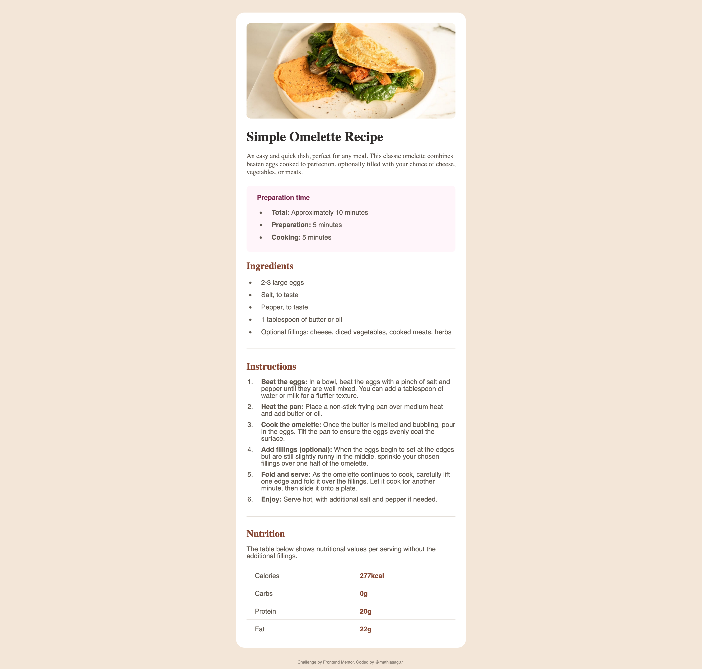
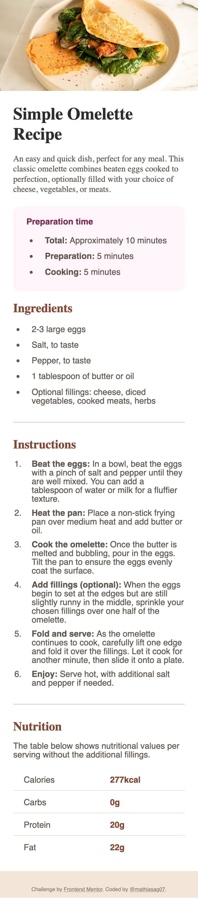

# Frontend Mentor - Recipe page solution

This is a solution to the [Recipe page challenge on Frontend Mentor](https://www.frontendmentor.io/challenges/recipe-page-KiTsR8QQKm). Frontend Mentor challenges help you improve your coding skills by building realistic projects.

## Table of contents

- [Overview](#overview)
  - [The challenge](#the-challenge)
  - [Screenshot](#screenshot)
  <!-- - [Links](#links) -->
- [My process](#my-process)
  - [Built with](#built-with)
  - [What I learned](#what-i-learned)
  <!-- - [Continued development](#continued-development) -->
  <!-- - [Useful resources](#useful-resources) -->
- [Author](#author)

## Overview

### The challenge
Build out a recipe page and get it looking as close to the design as possible.
You can use any tools you like to help you complete the challenge. So if you've got something you'd like to practice, feel free to give it a go.

### Screenshot

|Desktop version - 1440px|Mobile version - 375px|
|---|---|
|||

<!-- ### Links

- Solution URL: [Recipe-page code](https://github.com/mathiasag7/recipe-page)
- Live Site URL: [Add live site URL here](https://your-live-site-url.com) -->

## My process

### Built with

- Semantic HTML5 markup
- SCSS custom properties
- Flexbox

### What I learned

This was a fun challenge to work on. I learned how to use SCSS custom properties and how to use flexbox to create a responsive layout
<!-- 
### Useful resources

- [Mise en forme des tableaux](https://developer.mozilla.org/fr/docs/Learn_web_development/Core/Styling_basics/Tables) - This is a CSS property that allows you to control the position of the bullet points in a list.
- [list-style-position](https://developer.mozilla.org/fr/docs/Web/CSS/list-style-position) - This is a CSS property that allows you to control the position of the bullet points in a list. -->

## Author

<!-- - Website - [Add your name here](https://www.your-site.com) -->
- Frontend Mentor - [@mathiasag7](https://www.frontendmentor.io/profile/mathiasag7)
- Twitter - [@mathiasag07](https://www.twitter.com/mathiasag07)
